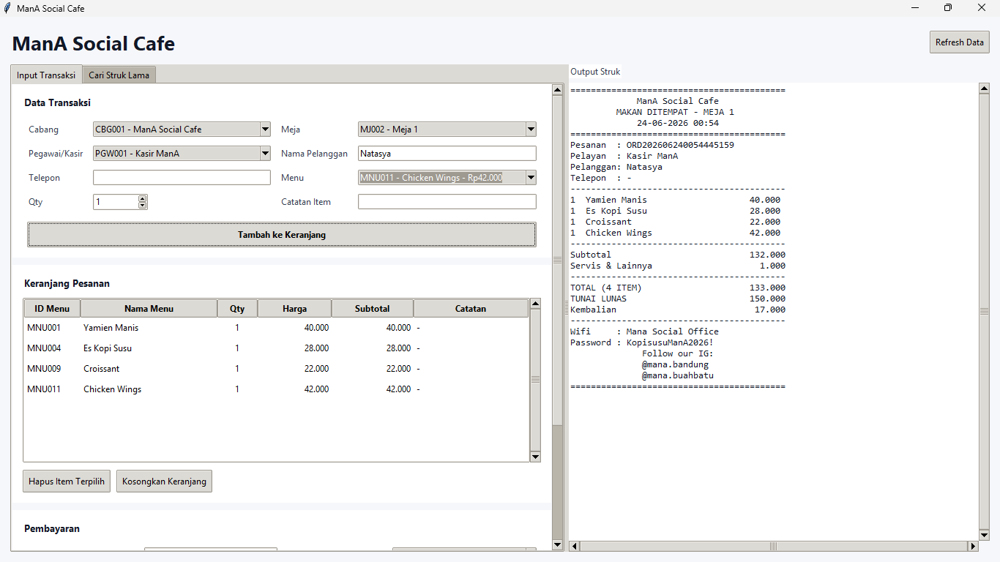

# Receipt Simulation — ManA Social Cafe

Silakan pilih bahasa dokumentasi terlebih dahulu.

Please choose the documentation language first.

- [Bahasa Indonesia](#bahasa-indonesia)
- [English](#english)

---

# Bahasa Indonesia

## Deskripsi Project

**Receipt Simulation — ManA Social Cafe** adalah aplikasi simulasi kasir sederhana yang dibuat berdasarkan hasil identifikasi data dari struk transaksi ManA Social Cafe. Project ini dibuat untuk memenuhi tugas mata kuliah **Basis Data**, khususnya pada proses membaca data dari struk, menentukan entitas dan atribut, merancang ERD, mentransformasikan ERD ke relasi tabel, lalu mengimplementasikannya ke dalam database MySQL.

Selain itu, project ini juga digunakan untuk mempelajari bagaimana sistem kasir bekerja secara sederhana, mulai dari memilih menu, menyimpan transaksi, menghitung total pembayaran, sampai menampilkan output struk.

Project ini bukan sistem kasir produksi. Fokus utama project ini adalah pembelajaran konsep basis data dan simulasi alur transaksi kasir.

Repository: <https://github.com/aqmalazza/ReceiptSimulation-ManASoscialCafe.git>

---

## Preview Aplikasi

Tambahkan screenshot aplikasi pada bagian ini setelah project berhasil dijalankan.

```md

```

Letakkan gambar utama aplikasi tepat di bawah bagian **Preview Aplikasi** agar pengunjung repository langsung memahami bentuk aplikasi yang dibuat.

---

## Struktur Project

```text
.
├── assets/
│   ├── ERD.png
│   └── Table Relationship.png
│
├── database/
│   ├── 00_reset.sql
│   ├── 01_schema.sql
│   ├── 02_seed.sql
│   ├── 03_queries.sql
│   ├── 99_full_setup.sql
│   ├── mana_social_cafe.sql
│   └── README_DATABASE.md
│
└── apps/
    ├── app.py
    ├── config.py
    ├── database.py
    ├── formatters.py
    ├── receipt.py
    ├── repositories.py
    ├── requirements.txt
    ├── README.md
    └── ui/
        ├── __init__.py
        ├── main_window.py
        └── widgets.py
```

---

## Desain Database

Database terdiri dari 9 tabel:

- `cabang`
- `meja`
- `pegawai`
- `pelanggan`
- `menu`
- `transaksi`
- `detail_transaksi`
- `biaya_tambahan`
- `pembayaran`

Tabel `detail_transaksi` digunakan sebagai tabel penghubung antara `transaksi` dan `menu`, karena satu transaksi dapat memiliki banyak menu dan satu menu dapat muncul pada banyak transaksi.

### ERD

```md

```

### Table Relationship

```md

```

---

## Teknologi yang Digunakan

- Python
- Tkinter
- MySQL
- mysql-connector-python
- phpMyAdmin / Laragon / XAMPP

---

## Instalasi Project

### 1. Clone Repository

```bash
git clone https://github.com/aqmalazza/ReceiptSimulation-ManASoscialCafe.git
cd ReceiptSimulation-ManASoscialCafe
```

### 2. Jalankan MySQL

Pastikan MySQL sudah berjalan menggunakan Laragon, XAMPP, atau MySQL Server.

Jika menggunakan Laragon:

```text
Laragon → Start All
```

Jika menggunakan XAMPP:

```text
XAMPP Control Panel → Start Apache dan MySQL
```

Buka phpMyAdmin melalui browser:

```text
http://localhost/phpmyadmin
```

### 3. Import Database

Masuk ke phpMyAdmin, lalu buka menu **Import**.

Pilih file berikut:

```text
database/99_full_setup.sql
```

Klik **Go** untuk menjalankan import.

File `99_full_setup.sql` akan membuat database `mana_social_cafe`, membuat tabel, primary key, foreign key, relasi, dan data awal yang dibutuhkan aplikasi.

Setelah import berhasil, pastikan terdapat database:

```text
mana_social_cafe
```

Di dalam database tersebut harus terdapat 9 tabel:

```text
biaya_tambahan
cabang
detail_transaksi
meja
menu
pegawai
pelanggan
pembayaran
transaksi
```

### 4. Alternatif Import Manual

Jika ingin menjalankan file SQL secara bertahap, gunakan urutan berikut:

```text
1. database/00_reset.sql
2. database/01_schema.sql
3. database/02_seed.sql
4. database/03_queries.sql
```

Keterangan file:

| File | Fungsi |
|---|---|
| `00_reset.sql` | Menghapus database lama jika ingin memulai dari awal. |
| `01_schema.sql` | Membuat struktur database, tabel, primary key, foreign key, dan constraint. |
| `02_seed.sql` | Mengisi data awal seperti cabang, meja, pegawai, pelanggan default, dan menu. |
| `03_queries.sql` | Berisi query untuk mengecek data dan relasi database. |
| `99_full_setup.sql` | File gabungan untuk setup database secara lengkap. |

### 5. Masuk ke Folder Aplikasi

```bash
cd apps
```

### 6. Install Dependency Python

```bash
pip install -r requirements.txt
```

Jika menggunakan Windows dan perintah `pip` tidak dikenali, gunakan:

```bash
py -m pip install -r requirements.txt
```

### 7. Sesuaikan Konfigurasi Database

Buka file:

```text
apps/config.py
```

Pastikan konfigurasi database sesuai dengan komputer yang digunakan.

Default konfigurasi:

```python
DB_CONFIG = {
    "host": "localhost",
    "user": "root",
    "password": "",
    "database": "mana_social_cafe",
    "port": 3306,
}
```

Jika MySQL menggunakan password, isi bagian `password`.

Contoh:

```python
"password": "password_mysql"
```

### 8. Jalankan Aplikasi

Masih di dalam folder `apps`, jalankan:

```bash
python app.py
```

Atau di Windows:

```bash
py app.py
```

Jika database dan dependency sudah benar, aplikasi **ManA Social Cafe** akan terbuka.

---

## Cara Menggunakan Aplikasi

1. Pilih cabang.
2. Pilih meja.
3. Pilih pegawai atau kasir.
4. Isi nama pelanggan jika ada.
5. Kosongkan nama pelanggan jika pelanggan tidak ingin menyebutkan nama.
6. Pilih menu.
7. Masukkan jumlah pesanan.
8. Tambahkan catatan item jika diperlukan.
9. Klik **Tambah ke Keranjang**.
10. Masukkan nominal pembayaran.
11. Klik **Simpan Transaksi & Cetak Struk**.

Setelah transaksi tersimpan, output struk akan muncul pada panel kanan aplikasi.

---

## Cetak Ulang Struk Lama

Aplikasi memiliki fitur pencarian struk lama. Transaksi dapat dicari berdasarkan:

- ID transaksi,
- nomor pesanan,
- nama pelanggan,
- atau nomor meja.

Fitur ini digunakan ketika pelanggan meminta struk kembali setelah transaksi sebelumnya sudah tersimpan.

---

## Bagaimana Output Struk Menjadi Kertas Struk

Struk yang tampil di aplikasi adalah preview digital yang dibuat dari data transaksi di database. Data transaksi disimpan ke MySQL, lalu aplikasi mengambil kembali data tersebut melalui relasi antar tabel dan menyusunnya menjadi format struk.

Alurnya adalah:

```text
Data transaksi disimpan ke MySQL
↓
Aplikasi mengambil data dari tabel yang saling berelasi
↓
Data disusun menjadi format struk
↓
Struk tampil pada aplikasi
↓
Struk dapat dikirim ke printer
↓
Printer mencetak struk ke kertas
```

MySQL tidak mencetak struk secara langsung. MySQL hanya menyimpan data transaksi. Proses pencetakan dilakukan oleh aplikasi melalui printer yang terhubung ke komputer.

Dalam penggunaan nyata, output struk dapat dicetak menggunakan printer biasa atau printer thermal kasir. Jika printer thermal sudah terpasang di Windows, aplikasi dapat dikembangkan dengan tombol **Cetak Struk** untuk mengirim teks struk ke printer tersebut. Dengan alur ini, output struk digital pada aplikasi dapat menjadi kertas struk yang diterima oleh pelanggan.

---

## Catatan

- Database harus diimport terlebih dahulu sebelum aplikasi dijalankan.
- Data menu, meja, cabang, dan pegawai diambil dari MySQL.
- Menu dengan status `tidak tersedia` tetap tampil, tetapi tidak dapat dimasukkan ke keranjang.
- Nama pelanggan boleh dikosongkan.
- Informasi WiFi, password, dan Instagram disimpan di `config.py`, bukan di database.
- Transaksi baru tersimpan pada tabel `transaksi`, `detail_transaksi`, `biaya_tambahan`, dan `pembayaran`.

[Back to language selection](#receipt-simulation--mana-social-cafe)

---

# English

## Project Description

**Receipt Simulation — ManA Social Cafe** is a simple cashier simulation application created from the data identification process of a ManA Social Cafe transaction receipt. This project was developed to fulfill a **Database** course assignment, especially in identifying data from a receipt, defining entities and attributes, designing an ERD, transforming the ERD into relational tables, and implementing the database in MySQL.

This project is also used to understand how a simple cashier system works, starting from selecting menu items, saving transactions, calculating payment totals, and displaying receipt output.

This is not a production cashier system. The main focus of this project is to learn database concepts and simulate a basic cashier transaction flow.

Repository: <https://github.com/aqmalazza/ReceiptSimulation-ManASoscialCafe.git>

---

## Application Preview

Add the application screenshot in this section after the project runs successfully.

```md

```

Place the main application screenshot directly under the **Application Preview** section so visitors can quickly understand the final result of the project.

---

## Project Structure

```text
.
├── assets/
│   ├── ERD.png
│   └── Table Relationship.png
│
├── database/
│   ├── 00_reset.sql
│   ├── 01_schema.sql
│   ├── 02_seed.sql
│   ├── 03_queries.sql
│   ├── 99_full_setup.sql
│   ├── mana_social_cafe.sql
│   └── README_DATABASE.md
│
└── apps/
    ├── app.py
    ├── config.py
    ├── database.py
    ├── formatters.py
    ├── receipt.py
    ├── repositories.py
    ├── requirements.txt
    ├── README.md
    └── ui/
        ├── __init__.py
        ├── main_window.py
        └── widgets.py
```

---

## Database Design

The database consists of 9 tables:

- `cabang`
- `meja`
- `pegawai`
- `pelanggan`
- `menu`
- `transaksi`
- `detail_transaksi`
- `biaya_tambahan`
- `pembayaran`

The `detail_transaksi` table is used as a bridge table between `transaksi` and `menu`, because one transaction can contain many menu items and one menu item can appear in many transactions.

### ERD

```md

```

### Table Relationship

```md

```

---

## Tech Stack

- Python
- Tkinter
- MySQL
- mysql-connector-python
- phpMyAdmin / Laragon / XAMPP

---

## Installation Guide

### 1. Clone the Repository

```bash
git clone https://github.com/aqmalazza/ReceiptSimulation-ManASoscialCafe.git
cd ReceiptSimulation-ManASoscialCafe
```

### 2. Start MySQL

Make sure MySQL is running using Laragon, XAMPP, or MySQL Server.

If using Laragon:

```text
Laragon → Start All
```

If using XAMPP:

```text
XAMPP Control Panel → Start Apache and MySQL
```

Open phpMyAdmin in the browser:

```text
http://localhost/phpmyadmin
```

### 3. Import the Database

Open phpMyAdmin, then go to the **Import** menu.

Choose this file:

```text
database/99_full_setup.sql
```

Click **Go** to run the import process.

The `99_full_setup.sql` file will create the `mana_social_cafe` database, tables, primary keys, foreign keys, relationships, and the initial data required by the application.

After the import process is complete, make sure the following database exists:

```text
mana_social_cafe
```

It should contain 9 tables:

```text
biaya_tambahan
cabang
detail_transaksi
meja
menu
pegawai
pelanggan
pembayaran
transaksi
```

### 4. Optional: Manual SQL Import

To run the SQL files step by step, use this order:

```text
1. database/00_reset.sql
2. database/01_schema.sql
3. database/02_seed.sql
4. database/03_queries.sql
```

File explanation:

| File | Description |
|---|---|
| `00_reset.sql` | Deletes the existing database if you want to start from zero. |
| `01_schema.sql` | Creates the database structure, tables, primary keys, foreign keys, and constraints. |
| `02_seed.sql` | Inserts initial data such as branch, tables, cashier, default customer, and menu. |
| `03_queries.sql` | Contains queries for checking data and database relationships. |
| `99_full_setup.sql` | Complete setup file for database installation. |

### 5. Go to the Application Folder

```bash
cd apps
```

### 6. Install Python Dependencies

```bash
pip install -r requirements.txt
```

If `pip` is not recognized on Windows, use:

```bash
py -m pip install -r requirements.txt
```

### 7. Check Database Configuration

Open:

```text
apps/config.py
```

Make sure the database configuration matches your local MySQL setup.

Default configuration:

```python
DB_CONFIG = {
    "host": "localhost",
    "user": "root",
    "password": "",
    "database": "mana_social_cafe",
    "port": 3306,
}
```

If your MySQL uses a password, update the `password` value.

Example:

```python
"password": "your_mysql_password"
```

### 8. Run the Application

From inside the `apps` folder, run:

```bash
python app.py
```

Or on Windows:

```bash
py app.py
```

If the database and dependencies are configured correctly, the **ManA Social Cafe** application will open.

---

## How to Use the Application

1. Select the branch.
2. Select the table number.
3. Select the cashier or employee.
4. Enter the customer name if available.
5. Leave the customer name empty if the customer does not want to provide a name.
6. Select a menu item.
7. Enter the quantity.
8. Add an item note if needed.
9. Click **Tambah ke Keranjang**.
10. Enter the payment amount.
11. Click **Simpan Transaksi & Cetak Struk**.

After the transaction is saved, the receipt output will appear on the right side of the application.

---

## Reprinting an Existing Receipt

The application provides a feature to search previous receipts. Transactions can be searched by:

- transaction ID,
- order number,
- customer name,
- or table number.

This feature is used when a customer asks for a receipt again after a transaction has already been saved.

---

## How the Receipt Output Becomes a Printed Receipt

The receipt shown in the application is a digital preview generated from transaction data stored in the database. The transaction data is saved to MySQL, then retrieved by the application through table relationships and formatted into a receipt layout.

The process is:

```text
Transaction data is saved to MySQL
↓
The application retrieves data from related tables
↓
The data is formatted into a receipt
↓
The receipt appears in the application
↓
The receipt can be sent to a printer
↓
The printer prints the receipt on paper
```

MySQL does not print the receipt directly. MySQL only stores transaction data. The printing process is handled by the application through a printer connected to the computer.

In real use, the receipt output can be printed using a regular printer or a thermal receipt printer. If a thermal printer is already installed in Windows, the application can be extended with a **Print Receipt** button to send the receipt text to the printer. Through this flow, the digital receipt output in the application can become a printed receipt received by the customer.

---

## Notes

- The database must be imported before running the application.
- Menu, table, branch, and cashier data are loaded from MySQL.
- Menu items with `tidak tersedia` status are displayed but cannot be added to the cart.
- Customer name can be left empty.
- WiFi, password, and Instagram information are stored in `config.py`, not in the database.
- New transactions are saved to `transaksi`, `detail_transaksi`, `biaya_tambahan`, and `pembayaran`.

[Back to language selection](#receipt-simulation--mana-social-cafe)
